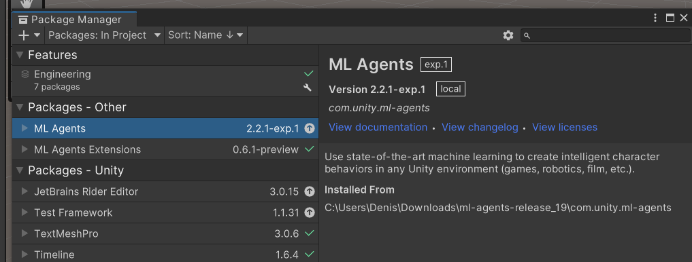
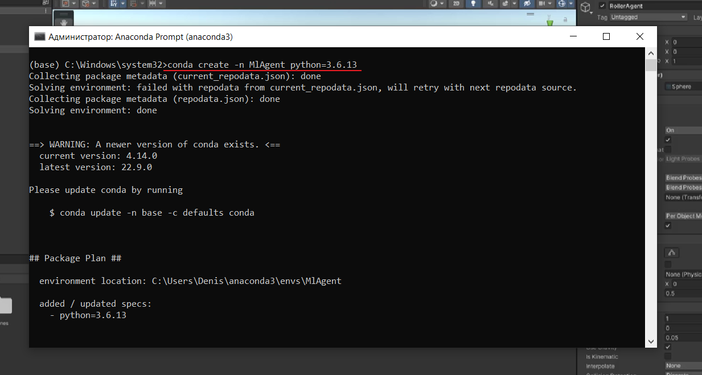
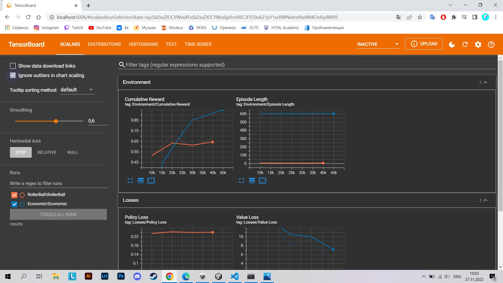
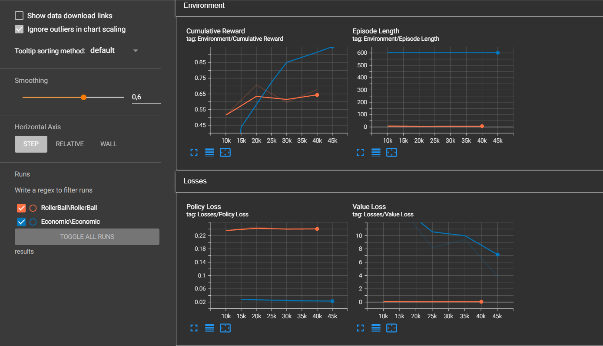
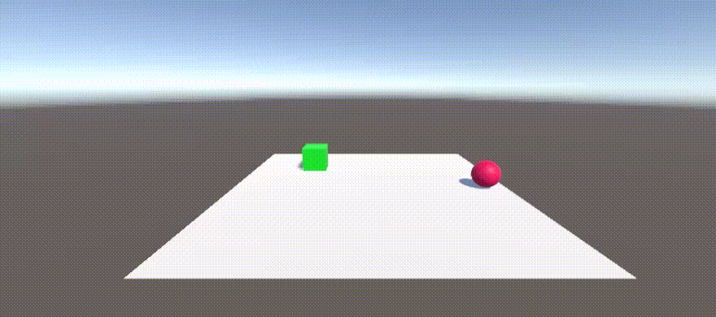

# АНАЛИЗ ДАННЫХ И ИСКУССТВЕННЫЙ ИНТЕЛЛЕКТ [in GameDev]
Отчет по лабораторной работе #3 выполнил:
- Плешивцев Денис Владимирович
- РИ-210948

Отметка о выполнении заданий (заполняется студентом):

| Задание | Выполнение | Баллы |
| ------ | ------ | ------ |
| Задание 1 | * | 60 |
| Задание 2 | * | 20 |
| Задание 3 | * | 20 |

знак "*" - задание выполнено; знак "#" - задание не выполнено;

Работу проверили:
- к.т.н., доцент Денисов Д.В.
- к.э.н., доцент Панов М.А.
- ст. преп., Фадеев В.О.

[](https://nodesource.com/products/nsolid)

[](https://travis-ci.org/joemccann/dillinger)

Структура отчета

- Данные о работе: название работы, фио, группа, выполненные задания.
- Цель работы.
- Задание 1.
- Код реализации выполнения задания. Визуализация результатов выполнения (если применимо).
- Задание 2.
- Код реализации выполнения задания. Визуализация результатов выполнения (если применимо).
- Задание 3.
- Код реализации выполнения задания. Визуализация результатов выполнения (если применимо).
- Выводы.
- ✨Magic ✨

## Цель работы
Познакомиться с программными средствами для создания системы машинного обучения и ее интеграции в Unity.

## Задание 1
### Реализовать систему машинного обучения в связке Python - Google-Sheets – Unity. При выполнении задания можно использовать видеоматериалы и исходные данные, предоставленные преподавателями курса.

- Создадал новый проект в Unity и подключил ML Agents и ML Agents Extensions через Package Manager.



- Далее запустил Anaconda Prompt и создал новую виртуальную среду для python 3.6.13. 



- Активировал среду и подключил необходимые библиотеки:
  - mlagents 0.28.0;
  - torch 1.7.1;
  



- В проекте Unity создал плоскость, сферу и куб.
  


- Подключил скрипт _"RollerAgent.cs"_ к сфере:
 
```csharp

using System.Collections;
using System.Collections.Generic;
using UnityEngine;
using Unity.MLAgents;
using Unity.MLAgents.Sensors;
using Unity.MLAgents.Actuators;

public class RollerAgent : Agent
{
    Rigidbody rBody;
    // Start is called before the first frame update
    void Start()
    {
        rBody = GetComponent<Rigidbody>();
    }

    public Transform Target;
    public override void OnEpisodeBegin()
    {
        if (this.transform.localPosition.y < 0)
        {
            this.rBody.angularVelocity = Vector3.zero;
            this.rBody.velocity = Vector3.zero;
            this.transform.localPosition = new Vector3(0, 0.5f, 0);
        }

        Target.localPosition = new Vector3(Random.value * 8-4, 0.5f, Random.value * 8-4);
    }
    public override void CollectObservations(VectorSensor sensor)
    {
        sensor.AddObservation(Target.localPosition);
        sensor.AddObservation(this.transform.localPosition);
        sensor.AddObservation(rBody.velocity.x);
        sensor.AddObservation(rBody.velocity.z);
    }
    public float forceMultiplier = 10;
    public override void OnActionReceived(ActionBuffers actionBuffers)
    {
        Vector3 controlSignal = Vector3.zero;
        controlSignal.x = actionBuffers.ContinuousActions[0];
        controlSignal.z = actionBuffers.ContinuousActions[1];
        rBody.AddForce(controlSignal * forceMultiplier);

        float distanceToTarget = Vector3.Distance(this.transform.localPosition, Target.localPosition);

        if(distanceToTarget < 1.42f)
        {
            SetReward(1.0f);
            EndEpisode();
        }
        else if (this.transform.localPosition.y < 0)
        {
            EndEpisode();
        }
    }
}

```

- Также добавил и настроил компоненты _Rigidbody_, _Decision Requester_, _Behavior Parameters_.
  


- В корень проекта добавил файл конфигурации нейронной сети _"rollerball_config.yaml"_:
  


- И наконец, запустил Ml Agent и проверил его работу: 
  


- Для ускорения обучения создал много копий модели _«Плоскость-Сфера-Куб»_.
  


- После обучения модели, получил такой результат:
  


## Задание 2
### Подробно опишите каждую строку файла конфигурации нейронной сети, доступного в папке с файлами проекта по ссылке. Самостоятельно найдите информацию о компонентах Decision Requester, Behavior Parameters, добавленных на сфере.

- ***Decision Requester*** - это компонент, который автоматически запрашивает решения для агента через регулярные промежутки времени. Без DecisionRequester реализация  агента должна вручную вызывать функцию RequestDecision().

- ***Behavior Parameters*** - это компонент для настройки поведения и свойств агента. Во время выполнения он определяет поведение объекта в соответствии с настройками, указанными в редакторе.

- ***rollerball_config.yaml***:

```yaml

behaviors:
  RollerBall: # id агента
    trainer_type: ppo # Тип тренировки, который будет использоваться (Обычно используется обучение с подкреплением PPO - Proximal Policy Optimization).
    hyperparameters: # Гиперпараметры.
      batch_size: 10 # Количество опытов в каждой итерации градиентного спуска. Этот парметр всегда должнен быть в несколько раз меньше, чем buffer_size.
      buffer_size: 100 # Количество опытов, которые необходимо сделать перед обновлением поведения модели.
      learning_rate: 3.0e-4 # Начальная скорость обучения.
      beta: 5.0e-4 # "Сила регуляризации энтропии", которая делает поведение объекта более "рандомным". Это гарантирует, что агенты должным образом исследуют пространство во время обучения.
      epsilon: 0.2 # Влияет на скорость изменения поведения во время обучения.
      lambd: 0.99 # Параметр регуляризации, используемый при расчете обобщенной оценки преимущества (GAE - Generalized Advantage Estimate).
      num_epoch: 3 # Количество проходов через буфер опыта при выполнении оптимизации градиентного спуска.
      learning_rate_schedule: linear # Определяет, как скорость обучения изменяется с течением времени. При linear скорость обучения уменьшается линейно, достигая 0 на max_steps.
    network_settings: # Настройки сети.
      normalize: false # Применяется ли нормализация к входным данным.
      hidden_units: 128 # Количество нейронов в скрытых слоях.
      num_layers: 2 # Количество скрытых слоев.
    reward_signals: # Настройка вознаграждения.
      extrinsic: # Внешние награды.
        gamma: 0.99 # Коэффициент поощерения.
        strength: 1.0 # Коэффициент, на который умножается вознаграждение.
    max_steps: 500000 # Общее количество шагов (т. е. собранных наблюдений и предпринятых действий), которые необходимо выполнить в среде (или во всех средах при параллельном использовании нескольких) перед завершением процесса обучения.
    time_horizon: 64 # Сколько опыта необходимо собрать для каждого агента, прежде чем добавить его в буфер опыта. Когда этот предел достигается до конца эпизода, оценка значения используется для прогнозирования общего ожидаемого вознаграждения из текущего состояния агента.
    summary_freq: 10000 # Количество опытов, которое необходимо сделать перед отображением статистики обучения. 
    
```

## Задание 3
### Доработайте сцену и обучите ML-Agent таким образом, чтобы шар перемещался между двумя кубами разного цвета. Кубы должны, как и в первом задании, случайно изменять координаты на плоскости.

- Внес изменения в _"RollerAgent.cs"_ :

```csharp

using System.Collections;
using System.Collections.Generic;
using UnityEngine;
using Unity.MLAgents;
using Unity.MLAgents.Sensors;
using Unity.MLAgents.Actuators;

public class RollerAgent : Agent
{
    Rigidbody rBody;
    // Start is called before the first frame update
    void Start()
    {
        rBody = GetComponent<Rigidbody>();
    }

    public Transform Target1;
    public Transform Target2;
    private bool target1IsReached;
    private bool target2IsReached;

    public override void OnEpisodeBegin()
    {
        if (this.transform.localPosition.y < 0)
        {
            this.rBody.angularVelocity = Vector3.zero;
            this.rBody.velocity = Vector3.zero;
            this.transform.localPosition = new Vector3(0, 0.5f, 0);
        }
        target1IsReached = false; // Достигла ли сфера первого куба
        target2IsReached = false; // Достигла ли сфера второго куба

        Target1.localPosition = new Vector3(Random.value * 8-4, 0.5f, Random.value * 8-4); // Координаты первого куба
        Target2.localPosition = new Vector3(Random.value * 8-4, 0.5f, Random.value * 8-4); // Координаты второго куба
        Target1.gameObject.SetActive(true); // "Активируем" первую цель 
        Target2.gameObject.SetActive(true); // "Активируем" вторую цель 
    }
    public override void CollectObservations(VectorSensor sensor)
    {
        sensor.AddObservation(Target1.localPosition);
        sensor.AddObservation(Target2.localPosition);
        sensor.AddObservation(this.transform.localPosition);
        sensor.AddObservation(rBody.velocity.x);
        sensor.AddObservation(rBody.velocity.z);
        // Добавляем наблюдение за тем, достигла ли сфера целей
        sensor.AddObservation(target1IsReached); 
        sensor.AddObservation(target2IsReached);
    }
    public float forceMultiplier = 10;
    public override void OnActionReceived(ActionBuffers actionBuffers)
    {
        Vector3 controlSignal = Vector3.zero;
        controlSignal.x = actionBuffers.ContinuousActions[0];
        controlSignal.z = actionBuffers.ContinuousActions[1];
        rBody.AddForce(controlSignal * forceMultiplier);

        float distanceToTarget1 = Vector3.Distance(this.transform.localPosition, Target1.localPosition); // Расстояние до первого куба
        float distanceToTarget2 = Vector3.Distance(this.transform.localPosition, Target2.localPosition); // Расстояние до второго куба

         // Проверка достижения первой цели
        if(!target1IsReached && distanceToTarget1 < 1.42f)
        {
            target1IsReached = true;
            Target1.gameObject.SetActive(false); // Убираем объект со сцены
        }

         // Проверка достижения второй цели
        if(!target2IsReached && distanceToTarget2 < 1.42f)
        {
            target2IsReached = true;
            Target2.gameObject.SetActive(false); // Убираем объект со сцены
        }

        // Если цели достигнуты, выдаем вознаграждение и заканчиваем эпизод
        if(target1IsReached && target2IsReached) 
        {
            SetReward(1.0f);
            EndEpisode();
        }
        else if (this.transform.localPosition.y < 0)
        {
            EndEpisode();
        }
    }
}

```

- Начал обучение новой модели: 
  


- В итоге, получил такой результат:
  


## Выводы

В ходе лабораторной работы, я познакомился с программными средствами для создания системы машинного обучения и ее интеграции в Unity. Увидел значимость обучения моделей. На тренировку второй модели я создал меньше копий и потратил мало времени. Как следствие, видно, что вторая модель работает более неуклюже.

Игровой же баланс для меня, это баланс между сложностью игры и удовольствием, получаемым от нее. Очевидно, что необоснованно легкая/сложная игра оттолкнет игрока через короткий промежуток времени, поскольку не будет приносить никакого удовольствия. Настроить игровой баланс может быть очень тяжело, здесь нам и поможет машинное обучение. Например, нейросети могут регулировать сложность игры, в зависимости от умений игрока, или помочь разработчикам подобрать оптимальные параметры при настройке какого-либо игрового элемента.

| Plugin | README |
| ------ | ------ |
| Dropbox | [plugins/dropbox/README.md][PlDb] |
| GitHub | [plugins/github/README.md][PlGh] |
| Google Drive | [plugins/googledrive/README.md][PlGd] |
| OneDrive | [plugins/onedrive/README.md][PlOd] |
| Medium | [plugins/medium/README.md][PlMe] |
| Google Analytics | [plugins/googleanalytics/README.md][PlGa] |

## Powered by

**BigDigital Team: Denisov | Fadeev | Panov**
