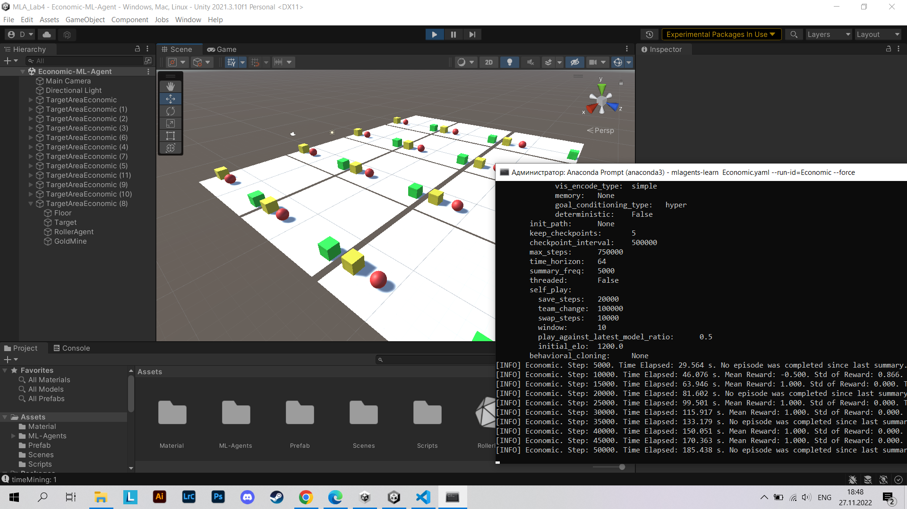
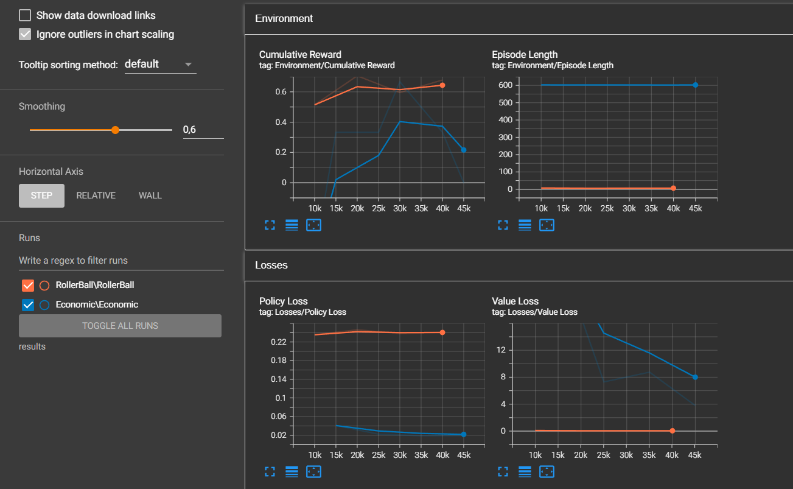
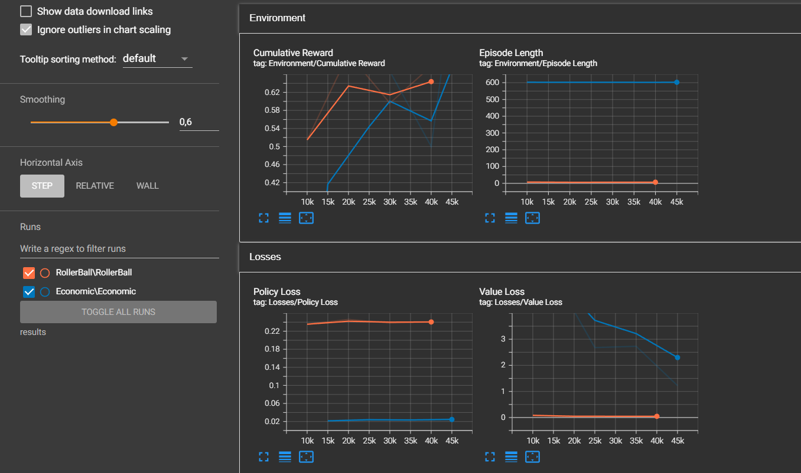
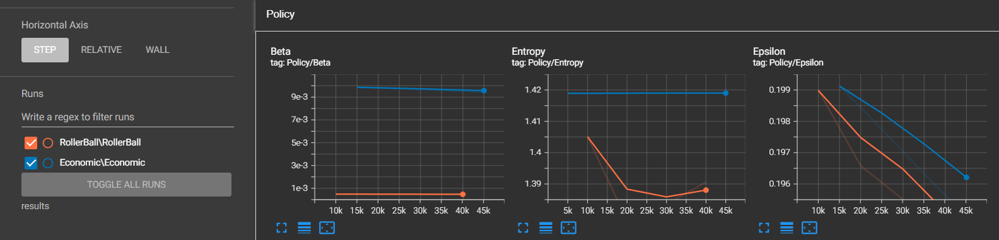
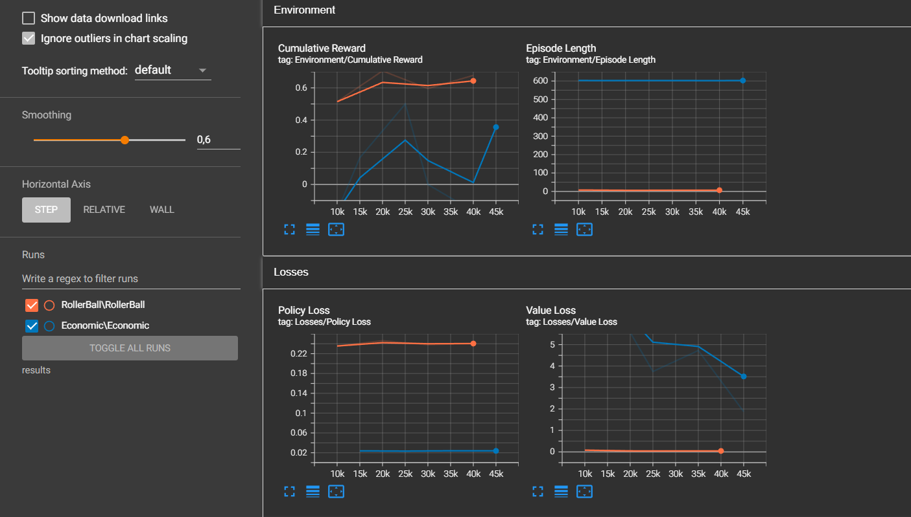

# АНАЛИЗ ДАННЫХ И ИСКУССТВЕННЫЙ ИНТЕЛЛЕКТ [in GameDev]
Отчет по лабораторной работе #5 выполнил:
- Плешивцев Денис Владимирович
- РИ-210948

Отметка о выполнении заданий (заполняется студентом):

| Задание | Выполнение | Баллы |
| ------ | ------ | ------ |
| Задание 1 | * | 60 |
| Задание 2 | * | 20 |
| Задание 3 | * | 20 |

знак "*" - задание выполнено; знак "#" - задание не выполнено;

Работу проверили:
- к.т.н., доцент Денисов Д.В.
- к.э.н., доцент Панов М.А.
- ст. преп., Фадеев В.О.

[](https://nodesource.com/products/nsolid)

[](https://travis-ci.org/joemccann/dillinger)

Структура отчета

- Данные о работе: название работы, фио, группа, выполненные задания.
- Цель работы.
- Задание 1.
- Код реализации выполнения задания. Визуализация результатов выполнения (если применимо).
- Задание 2.
- Код реализации выполнения задания. Визуализация результатов выполнения (если применимо).
- Задание 3.
- Код реализации выполнения задания. Визуализация результатов выполнения (если применимо).
- Выводы.
- ✨Magic ✨

## Цель работы
Интеграция экономической системы в проект Unity и обучение ML-Agent.

## Задание 1
### Измените параметры файла. yaml-агента и определите какие параметры и как влияют на обучение модели.

- Открыл проект в Unity и подключил _ML Agents_ и _ML Agents Extensions_ через Package Manager. С помощью _Anaconda Prompt_ активировал виртуальное пространство и запустил обучение агента.



- Далее установил в виртуальную среду _TensorFlow_ и открыл _TensorBoard_. 


### Default

- Параметры по умолчанию. ```Economic.yaml```:
  
```yaml

behaviors:
  Economic:
    trainer_type: ppo
    hyperparameters:
      batch_size: 1024
      buffer_size: 10240
      learning_rate: 3.0e-4
      learning_rate_schedule: linear
      beta: 1.0e-2
      epsilon: 0.2
      lambd: 0.95
      num_epoch: 3      
    network_settings:
      normalize: false
      hidden_units: 128
      num_layers: 2
    reward_signals:
      extrinsic:
        gamma: 0.99
        strength: 1.0
    checkpoint_interval: 500000
    max_steps: 750000
    time_horizon: 64
    summary_freq: 5000
    self_play:
      save_steps: 20000
      team_change: 100000
      swap_steps: 10000
      play_against_latest_model_ratio: 0.5
      window: 10
    
```

- После обучения получил такой результат в _TensorBoard_. График ___Cumulative Reward___ возрастает монотонно вверх.


### Learning_rate 

- ```learning_rate``` отвечает за начальную скорость обучения для градиентного спуска. Соответствует силе обновления градиентного спуска на каждом шагу. Обычно это значение следует уменьшать, если обучение нестабильно, а вознаграждение не увеличивается постоянно. Попробовал увеличить его до ```1.0e-3``` и обучил модель:



- В _TensorBoard_ видно, что ___Cumulative Reward___ стал вести себя нестабильно. Вознаграждение стало возрастать гораздо медленнее, а потом вовсе начало уменьшаться. Уменьшил значение до ```learning_rate: 1.0e-5```. График стал чуть лучше, вознаграждение возрастает, хоть и не монотонно и довольно медленно:



### Beta

- Обратил внимание на график ___Entropy___. В предыдущем "опыте" его значение оставалось константой. С этим значением связан параметр ```beta```. Это сила энтропийной регуляризации, которая делает политику  агента «более случайной». Это гарантирует, что агенты должным образом исследуют пространство действия во время обучения. Увеличение этого параметра обеспечит выполнение большего количества случайных действий. Параметр должен быть скорректирован таким образом, чтобы ___Entropy___  медленно уменьшалась вместе с увеличением вознаграждения. Если энтропия падает слишком медленно, нужно уменьшить ```beta```.



- Изменил значение параметра до ```beta: 1.0e-4```:


- В _TensorBoard_ вознаграждение за обучение достигло своего пика и перестало расти. При этом _Энтропия_ начала медленно уменьшаться:


### Epsilon: 

- Вернул настройки по умолчанию и изменил следующий параметр. ```epsilon``` влияет на то, насколько быстро политика может развиваться во время обучения. Соответствует допустимому порогу расхождения между старой и новой политикой при обновлении градиентного спуска. Установка небольшого значения этого параметра приведет к более стабильным обновлениям, но также замедлит процесс обучения. Попробовал увеличить его до ```0.6```:


- Из графика видно, что на каждом шагу вознаграждение стабильно составляло константу. Попробовал изменить параметр до ```epsilon: 0.1```, тогда график вернулся в исходное состояние:


### Num_epoch 

- Попробовал увеличить в два раза ```num_epoch```. Этот параметр  отвечает за количество проходов через буфер опыта при выполнении оптимизации градиентного спуска. График стал вести себя нестабильно, вознаграждение росло гораздо медленее:



### Lambd

- В конце решил уменьшить ```lambd``` до ```0.8```. Параметр влияет на то, насколько агент полагается на свою текущую оценку стоимости при вычислении обновленной оценки стоимости. Низкие значения соответствуют большему полаганию на собственную оценку. Вознаграждение монотонно возрастало, пока не достигло своего максимального значения:


## Задание 2
### Опишите результаты, выведенные в TensorBoard. 

- ***Decision Requester*** - это компонент, который автоматически запрашивает решения для агента через регулярные промежутки времени. Без DecisionRequester реализация  агента должна вручную вызывать функцию RequestDecision().

- ***Behavior Parameters*** - это компонент для настройки поведения и свойств агента. Во время выполнения он определяет поведение объекта в соответствии с настройками, указанными в редакторе.

## Выводы

В ходе лабораторной работы, я познакомился с программными средствами для создания системы машинного обучения и ее интеграции в Unity. Увидел значимость обучения моделей. На тренировку второй модели я создал мало копий и потратил меньше времени. Как следствие, видно, что вторая модель работает более неуклюже.

Игровой же баланс для меня, это баланс между сложностью игры и удовольствием, получаемым от нее. Очевидно, что необоснованно легкая/сложная игра оттолкнет игрока через короткий промежуток времени, поскольку не будет приносить никакого удовольствия. Настроить игровой баланс может быть очень тяжело, здесь нам и поможет машинное обучение. Например, нейросети могут регулировать сложность игры, в зависимости от умений игрока, или помочь разработчикам подобрать оптимальные параметры при настройке какого-либо игрового элемента.

| Plugin | README |
| ------ | ------ |
| Dropbox | [plugins/dropbox/README.md][PlDb] |
| GitHub | [plugins/github/README.md][PlGh] |
| Google Drive | [plugins/googledrive/README.md][PlGd] |
| OneDrive | [plugins/onedrive/README.md][PlOd] |
| Medium | [plugins/medium/README.md][PlMe] |
| Google Analytics | [plugins/googleanalytics/README.md][PlGa] |

## Powered by

**BigDigital Team: Denisov | Fadeev | Panov**
